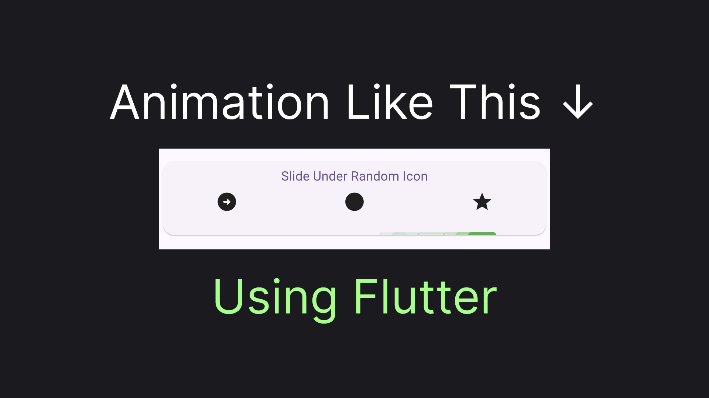

# Flutter Animations: Getting Started

> A tutorial on how to build a simple, yet functional animation in Flutter

I've always found it fascinating how ridiculously complex Flutter tutorials make animating a bouncing ball... or making some other useless for a real app animation. I'll try to make this article different. We will build a sliding tab indicator, like the one you can find in a `TabBar` widget. The animation will only require one widget and one controller. Without further ado, let's get started!

> You can check exactly what we are going to do in the [TLDR;](#tldr)



## ~~Needle~~ Indicator in the ~~Hay~~stack

First, let's create a widget of the indicator itself. We'll just have a slightly rounded, fixed width and height rectangle, like that:

```dart
class Indicator extends StatelessWidget {
  @override
  Widget build(BuildContext context) {
    return Container(
      width: 30,
      height: 3,
      decoration: BoxDecoration(
        color: Colors.green,
        borderRadius: BorderRadius.vertical(top: Radius.circular(5))
      ),
    );
  }
}
```

Our indicator is supposed to slide under the icons equally distributed around the card. The indicator should slide on top of the card like it would in the case of Tabs. This is a case for the `Stack` widget. We'll also need a button for triggering the animation, for now, it will not do anything. Let's build our "canvas" as a widget, allowing us to pass our Indicator and Triggering action as a `child` and `onButtonPressed` parameters: 

```dart
class ShowcaseStackCard extends StatelessWidget {
  final Widget child;
  final Function()? onButtonPressed;

  const ShowcaseStackCard({
    super.key,
    this.onButtonPressed,
    required this.child,
  });
  
  @override
  Widget build(BuildContext context) {
    return Card(
      child: SizedBox(
        height: 80,
        child: Stack(
          children: [
            Column(
              mainAxisSize: MainAxisSize.min,
              children: [
                TextButton(
                  onPressed: onButtonPressed,
                  child: Text('Slide Under Random Icon')
                ),
                Row(
                  children: [
                    Expanded(child: Icon(Icons.square)),
                    Expanded(child: Icon(Icons.circle)),
                    Expanded(child: Icon(Icons.star)),
                  ],
                )
              ],
            ),
            child
          ],
        ),
      ),
    );
  }
}
```

Let's see what we'll have now if we just pass a fresh `Indicator` as a parameter:

```dart
ShowcaseStackCard(
  child: Indicator(), 
);
```


## Placing the Indicator

As you may see, the indicator is now in the top left corner of the `Stack`. Of course, that's not what we want. Although the `Positioned` widget might sound like an obvious choice for positioning the widget inside a `Stack`, `Positioned` doesn't provide us a way to know the parent `Stack` size, which is essential for proper placement. Instead, we'll use a combination of `LayoutBuilder` for accessing parent size and `Padding` for placement, relative to the top left corner. Let's wrap this in a widget:

```dart
class RelativelyPositioned extends StatelessWidget {
  final Widget child;
  final Offset Function(Size size) positionCalculator;

  const RelativelyPositioned({
    super.key,
    required this.child,
    required this.positionCalculator,
  });

  @override
  Widget build(BuildContext context) {
    return LayoutBuilder(
      builder: (context, constrained) {
        var position = positionCalculator(constrained.biggest);
        return Padding(
          padding: EdgeInsets.only(
            top: position.dy,
            left: position.dx
          ),
          child: child,
        );
      }
    );
  }
}
```

Calculating top offset is trivial, it's just `size.height - 3`. For the left offset let's calculate how much offset we'll need to do to end up under an icon at a particular index. Let's imagine our real estate hosting two occupants: spaces and indicators (places for indicators). Below each icon, we'll have: `Left Spacing -> Indicator Spacing -> Right Spacing`. With that in mind here are the resulting calculations:

```dart
double calculateLeftOffset(int targetIndex, double totalWidth) {
  var totalElementsCount = 3;
  var indicatorWidth = 30;

  var spaceWidth = (totalWidth - indicatorWidth * totalElementsCount) / (totalElementsCount * 2);
  var usedBySpaces = (1 + (targetIndex * 2)) * spaceWidth;
  var usedByIndicators = targetIndex * indicatorWidth;
  return usedBySpaces + usedByIndicators;
}
```

Using the newly created widgets and function we'll be able to position our indicator under the rightmost icon (index = 2).

```dart
class TabsIndicatorCaseV2 extends StatelessWidget {
  @override
  Widget build(BuildContext context) {
    return ShowcaseStackCard(
      child: RelativelyPositioned(
        positionCalculator: (size) => Offset(
          calculateLeftOffset(2, size.width),
          size.height - 3
        ),
        child: Indicator()
      ), 
    );
  }
}
```


## Indicator on It's Way

Now let's get back to the animation. When an animation is triggered our indicator should slowly move from the offset of the index from which the animation is starting towards the offset of the index where the indicator must end up. So to calculate indicator offset at any given time we will need to know:

- `sourceIndex` to calculate starting offset
- `targetIndex` to calculate target offset.
- `progress` of the animation. With 0 meaning indicator is under the source, 1 meaning indicator is under the target, and 0.5 meaning indicator is half way through.

Here's what the resulting calculation will look like:

```dart
double calculateMovingLeftOffset({
  required int sourceIndex,
  required int targetIndex,
  required double progress,
  required double totalWidth
}) {
  var targetPosition = calculateLeftOffset(targetIndex, totalWidth);
  var sourcePosition = calculateLeftOffset(sourceIndex, totalWidth);

  var distance = (targetPosition - sourcePosition).abs();
  var passedDistance = distance * progress;

  return targetPosition > sourcePosition
      ? sourcePosition + passedDistance
      : sourcePosition - passedDistance;
}
```

With the calculation parameters in mind, we can figure out what our button should do. Besides knowing the `current` selected index, we should also track the `previous` selected index to correctly animate the widget. The flutter-way to organize the tracking will be to create a controller, implementing `ValueListenable`. Here's how it will look in our case:

```dart
class IndexSelection {
  final int current;
  final int? previous;

  IndexSelection(this.current, this.previous);
}

class IndexSelectionController extends ChangeNotifier implements ValueListenable<IndexSelection> {
  IndexSelection _value = IndexSelection(0, null);
  @override
  IndexSelection get value => _value;

  void select(int tabIndex) {
    _value = IndexSelection(tabIndex, _value.current);
    notifyListeners();
  }

  void switchRandom(int total) {
    var random = Random();
    var target = random.nextInt(total);
    while (target == _value.current) {
      target = random.nextInt(total);
    }

    select(target);
  }
}
```

To combine this all in a functional widget we'll listen to our `IndexSelectionController` utilizing `ValueListenableBuilder`. Since we have not yet really implemented an animation we will hard code `progress` to be `1`, meaning that the indicator will immediately end up in the target location. This is what we'll get:

```dart
class TabsIndicatorCaseV3 extends StatelessWidget {
  final IndexSelectionController indexController = IndexSelectionController();

  @override
  Widget build(BuildContext context) {
    return ShowcaseStackCard(
      child: ValueListenableBuilder(
        valueListenable: indexController,
        builder: (context, v, child) {
          return RelativelyPositioned(
            positionCalculator: (size) => Offset(
              calculateMovingLeftOffset(
                sourceIndex: v.previous ?? 0, 
                targetIndex: v.current,
                progress: 1,
                totalWidth: size.width), 
              size.height - 3
            ),
            child: Indicator());
        }
      ),
      onButtonPressed: () => indexController.switchRandom(3)
    );
  }
}
```


## Animating the Indicator

Finally, let's implement the animation! Remember, that I've said we'll need only one widget and one controller for that. Well, the controller is, unsurprisingly, an `AnimationController`. An `AnimationController` have a `vsync` parameter accepting `SingleTickerProviderStateMixin`. To get the `SingleTickerProviderStateMixin` we'll need to first convert our widget to a Stateful Widget and add this class in the mix. Then, we'll be able to create the `AnimationController` passing `this` and a required animation `duration`. We'll use 200 milliseconds in our case. Here's what it may look like:

```dart
class _TabsIndicatorCaseFinalState extends State<TabsIndicatorCaseFinal> with SingleTickerProviderStateMixin {
  late final AnimationController animationController = AnimationController(
    duration: const Duration(milliseconds: 200),
    vsync: this,
  );

  // ...
}
```

To trigger the animation we'll have to call a method on the animation controller. In our case we want animation to always start from the very beginning (0) and move `forward` - up to the end (1). We also need to trigger the animation every time the index controller state changes. To bind the controller together we'll take advantage of the fact that `IndexSelectionController` is listenable and listen for the controller events to trigger the navigation. A perfect place to set up the binding would be the `initState` method. Here's how we'll do it: 

```dart
@override
void initState() {
  super.initState();

  indexController.addListener(() {
    animationController.forward(from: 0);
  });
}
```

Now, we'll replace our previously hard-coded progress with the actual animation progress indicated by the `animationController.value`:

```dart
progress: animationController.value,
```

And instead of listening to `IndexSelectionController` via `ValueListenableBuilder`, we'll now listen to state changes of the animation controller. This will be done by utilizing a single widget we'll need for implementing the animation: `AnimationBuilder`:

```dart
AnimatedBuilder(
    animation: animationController,
    builder: (context, child) {
    // ...
),
```

Here's what the full code of our animated widget will look like:

```dart
class TabsIndicatorCaseFinal extends StatefulWidget {
  @override
  State<TabsIndicatorCaseFinal> createState() => _TabsIndicatorCaseFinalState();
}

class _TabsIndicatorCaseFinalState extends State<TabsIndicatorCaseFinal> with SingleTickerProviderStateMixin {
  late final AnimationController animationController = AnimationController(
    duration: const Duration(milliseconds: 200),
    vsync: this,
  );
  final IndexSelectionController indexController = IndexSelectionController();

  @override
  void initState() {
    super.initState();

    indexController.addListener(() {
      animationController.forward(from: 0);
    });
  }

  @override
  Widget build(BuildContext context) {
    return ShowcaseStackCard(
      child: AnimatedBuilder(
        animation: animationController,
        builder: (context, child) {
          return RelativelyPositioned(
            positionCalculator: (size) => Offset(
              calculateMovingLeftOffset(
                sourceIndex: indexController.value.previous ?? 0,
                targetIndex: indexController.value.current,
                progress: animationController.value,
                totalWidth: size.width
              ),
              size.height - 3
            ),
            child: Indicator(), 
          );
        }),
      onButtonPressed: () => indexController.switchRandom(3)
    );
  }
}
```

This is the last lines of code we'll need, but before we'll see the result, let's sum up what we have done in this article!

## TLDR;

Using `AnimationController` we were able to trigger animation by calling `animationController.forward(from: 0);` when a user taps on `Slide Under Random Icon`. Then on each `AnimatedBuilder` build we calculate `currentPosition` based on the current progress indicated by the `animation.value`, starting indicator position, stored as  `tabSelection.previous` and target indicator position, stored as `tabSelection.current`. And this is what it looks like:

> Keep in mind that this below is a gif, and the animation is much smoother in the real-life


You can check out the full code [here](https://github.com/astorDev/fanci/blob/main/flutter/lib/animation/stack_based_case.dart). There's also a playground app in the repo. And one more thing... Claps are appreciated! 👏
