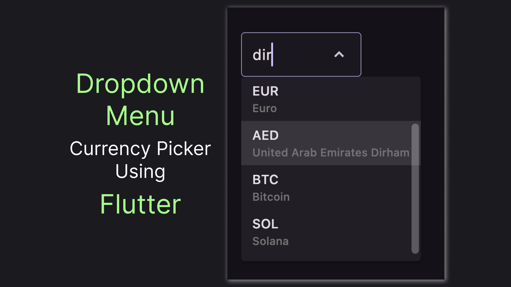

# Flutter DropdownMenu In-Depth

Flutter 3.10 introduced a new dropdown widget: DropdownMenu. This widget is way more versatile than the previously used DropdownButton and Flutter docs recommend to use it over the old widget. Yet there's not much information available on the widget. In this article we'll play around with the widget, investigating its various aspects and functionalities. Let's jump to the code!



## Preparing the Basics

How about we build something we can see in a real application? How about a currency picker? I hope this seems fun, so let's define our model and prepare a few options for our picker:

```dart
class Currency {
  final String code;

  Currency({
    required this.code
  });
}

List<Currency> currencies = [
  Currency(code: 'USD'),
  Currency(code: 'EUR'),
  Currency(code: 'AED'),
  Currency(code: 'BTC'),
  Currency(code: 'SOL'),
];
```

With the models prepared let's create a very simple and minimal `DropdownMenu`

```dart
DropdownMenu(
  initialSelection: currencies[0],
  dropdownMenuEntries: [
    for (var currency in currencies)
      DropdownMenuEntry(
        label: currency.code,
        value: currency
      )
  ]
)
```

Gladly, the widget is a "battery-included" type of widget, so just the small code gives us nice-looking widget with built-in search:


One of the important aspects of investigating a widget is seeing how we can customize its look, shall we?

## Spicing the Looks

By default, a `DropdownMenu` expands so that all of it's elements are visible. This is not very appropriate for a long list, which a currency list in a real application will be. Gladly, limiting the widget size is just a matter of a single property, so let's use it:

```dart
menuHeight: 200,
```

Next, let's walk towards a more minimalistic look for our widget. To my taste, the default arrow icons are slightly obese. To change it we would have to adjust both the down icon (`trailingIcon` property) and the up icon (`selectedTrailingIcon`). Here's how the updated version might look:

```dart
trailingIcon: Icon(
  Icons.keyboard_arrow_down_sharp,
  size: 20,
),
selectedTrailingIcon: Icon(
  Icons.keyboard_arrow_up_sharp,
  size: 20
),
```

One other thing we can do to create a more minimalistic look is to make our borders tinier. Note that to properly change the border we should update both `enabledBorder` and `focusedBorder` instead of a shared `border` property as it ignores `width` and `color` setups. To still recognize a dropdown with such a tiny border we'll need to set a fill for our widget. Here's the code, combined:

```dart
inputDecorationTheme: InputDecorationTheme(
  filled: true,
  fillColor: Theme.of(context).colorScheme.onSurface.withOpacity(0.03),
  enabledBorder: OutlineInputBorder(
    borderSide: BorderSide(
      color: Theme.of(context).colorScheme.onSurface.withOpacity(0.1),
      width: 0.6
    ),
  ),
  focusedBorder: OutlineInputBorder(
    borderSide: BorderSide(
      color: Theme.of(context).colorScheme.primary.withOpacity(1),
      width: 0.6
    ),
  )
)
```

With those customizations, we'll get a widget that looks just a little lighter in my opinion:


Changing widget looks is fun, but a deep understanding of a widget implies we can tweek it's behaviour also. Let's do just that!

## Search on Steroids

To do a behaviour customization we first need to have a more complex model. Let's add a name to our currencies:

```dart
class Currency {
  final String code;
  final String name;

  Currency({
    required this.code,
    required this.name
  });
}

List<Currency> currencies = [
  Currency(code: 'USD', name: 'United States Dollar'),
  Currency(code: 'EUR', name: 'Euro'),
  Currency(code: 'AED', name: 'United Arab Emirates Dirham'),
  Currency(code: 'BTC', name: 'Bitcoin'),
  Currency(code: 'SOL', name: 'Solana'),
];
```

To see a currency name we'll need to create our own `labelWidget` implementation, instead of the default one. Here's an example of how we might do it:

```dart
DropdownMenuEntry(
  label: currency.code,
  labelWidget: Column(
    crossAxisAlignment: CrossAxisAlignment.start,
    children: [
      Text(currency.code),
      Text(
        currency.name, 
        style: TextStyle(fontSize: 12, color: Colors.grey[600])
      )
    ],
  ),
  value: currency
)
```

The thing we'll make cooler is the currencies search. Instead of just allowing search by the `code` we'll implement case-incensitive search by both code and name. Let's add this method to the `Currency` class:

```dart
bool contains(String search) {
  return code.toLowerCase().contains(search.toLowerCase()) 
    || name.toLowerCase().contains(search.toLowerCase());
}
```

And utilize it in our custom search logic:

```dart
searchCallback: (List<DropdownMenuEntry<Currency?>> entries, String query) {
  return entries.indexWhere((e) => e.value!.contains(query));
},
```

This will give us our final `DropdownMenu`


This wraps our dive into the world of `DropdownMenu`, let's wrap it up with a quick recap and a few useful links.

## Recap

We've played around with the recommended widgets for creating a selection box: DropdownMenu. We've created a nice and flexible currency picker, learning how to customize both looks and behaviour of the widget along the way. You can find the playground app source code in the [Fanci repository](https://github.com/astorDev/fanci/), and by the way... claps are appreciated! 👏

