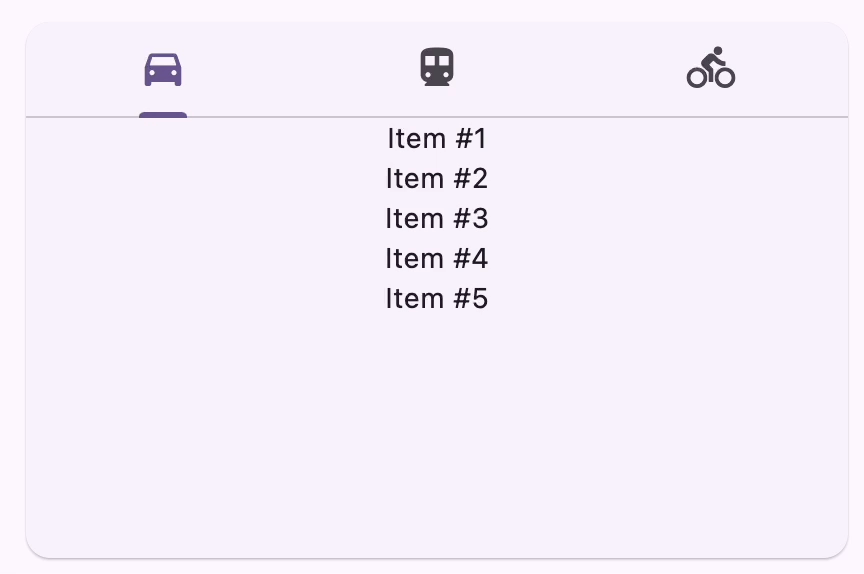
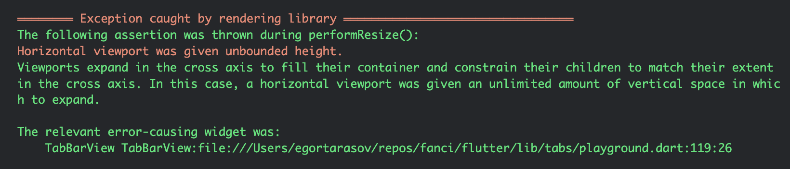
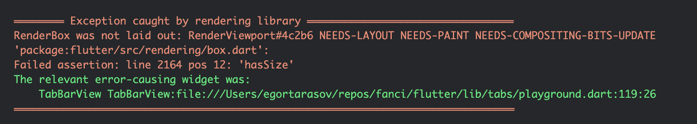
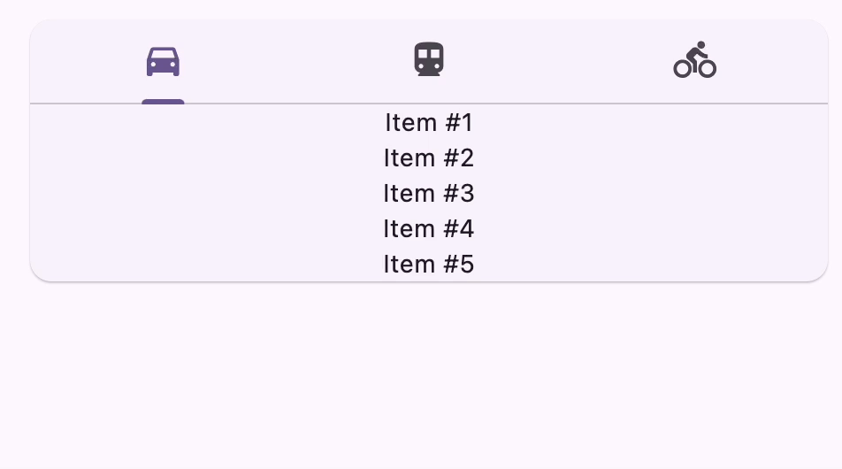

# Flutter Tabs: TabBar and TabBarView.

Tabs are a powerful layout tool frequently handy for a Flutter app. Interestingly enough, Flutter provides a rather unusual way of implementing them. In this article, I'll show you how to create a tab view. Starting from the basic implementation we'll investigate a few limitations and peculiarities Flutter tabs have and will try to overcome them. Let's jump to the code!

## Jump Start

Before creating a tab let's prepare a helper widget, that will help us easily mock tabs content. Here's a simple widget that will help us to generate a column with a supplied number of items:

```dart
class MockColumn extends StatelessWidget {
  final int itemCount;

  const MockColumn(this.itemCount);

  @override
  Widget build(BuildContext context) {
    var range = List<int>.generate(itemCount, (i) => i + 1);

    return Column(
      children: range.map((i) => Text('Item #$i')).toList(),
    );
  }
}
```

That will do! Now, instead of going round and about how about I just present you the code? Here's our `BuiltInTabsPlayground`:

```dart
class BuiltInTabsPlayground extends StatelessWidget {
  @override
  Widget build(BuildContext context) {
    return Column(
      children: [
        Card(
          child: DefaultTabController(
            length: 3, 
            child: Column(
              children: [
                TabBar(
                  tabs: [
                    Tab(icon: Icon(Icons.directions_car)),
                    Tab(icon: Icon(Icons.directions_transit)),
                    Tab(icon: Icon(Icons.directions_bike)),
                  ]
                ),
                SizedBox( 
                  height: 220.0,
                  child: TabBarView(
                    children: [
                      MockColumn(5),
                      MockColumn(10),
                      MockColumn(7)
                    ]
                  ),
                )
              ]
            )
          ),
        ),
      ],
    );
  }
}
```

And this is what the widget looks like:



That seems good enough! However, if we'll study the code deeper we'll find a few concerning pieces about it.

## `DefaultTabController` and Other Peculiarities

You may notice the `SizedBox` with the hard-coded `height` and have a temptation to just remove it - why would we need it, right? Unfortunately, however, if we just comment out the `height` of the `SizedBox` we'll get the nasty error, saying:

```markdown
The following assertion was thrown during performResize():
Horizontal viewport was given unbounded height.
Viewports expand in the cross axis to fill their container and constrain their children to match their extent in the cross axis. In this case, a horizontal viewport was given an unlimited amount of vertical space in which to expand.
```


```markdown
════════ Exception caught by rendering library ═════════════════════════════════
RenderBox was not laid out: RenderViewport#9c770 NEEDS-PAINT NEEDS-COMPOSITING-BITS-UPDATE
'package:flutter/src/rendering/box.dart':
Failed assertion: line 2164 pos 12: 'hasSize'
The relevant error-causing widget was:
    TabBarView TabBarView:file:///Users/egortarasov/repos/fanci/flutter/lib/tabs/playground.dart:119:26
════════════════════════════════════════════════════════════════════════════════
```



For now, let's get the `height` back and investigate other peculiarities we have in our implementation.

If you coded in Flutter long enough you've probably already encountered Controllers. However, for me, it was the first Controller that is also a widget. Normally, controllers sit as a field in a widget state, allowing us to control certain behaviours. Seems like `DefaultTabController` is slightly different - it's not really supposed to be used by **you**, but it **is** supposed to be used by `TabBar` and `TabBarView`. In fact, both of those widgets also accept `TabController` as a parameter.

`DefaultTabController` is not just a widget, it is an `InheritedWidget`. Essentially using it as a widget produces a scope in which its children will bind to it. Serendipitously, that lays a comfortable foundation for us to fix the annoying `TabBarView` sizing problem by creating our own alternative and connecting to the same controller as our built-in counterpart.

> Probably, the hard-coded controller's `length` is also worth mentioning in the list of strange things. However, despite being annoying boilerplate it doesn't seem to produce much harm. So we'll leave it as it is for now.

## Creating the `TabContentView`

Besides being an `InheritedWidget` `DefaultTabController` is also a `Listenable` (as most of the controllers are). So, all we'll need to do is listen to the controller changes and update shown widget when they occur

> The implementation could be made more complex if we add animation. However, this is out of the scope of this article.

```dart
class TabContentView extends StatelessWidget {
  final List<Widget> children;

  const TabContentView({
    super.key,
    required this.children,
  });

  @override
  Widget build(BuildContext context) {
    var controller = DefaultTabController.of(context);
    
    return ListenableBuilder(
      listenable: controller,
      builder: (context, child) {
        return children[controller.index];
      }
    );
  }
}
```

Now, if we use our `TabContentView` in the same structure we had before, we will be able to get rid of the `SizedBox` and its annoying hard-coded `height`.

```dart
class Main extends StatelessWidget {
  @override
  Widget build(BuildContext context) {
    return Column(
      children: [
        Card(
          child: DefaultTabController(
            length: 3, 
            child: Column(
              children: [
                TabBar(
                  tabs: [
                    Tab(icon: Icon(Icons.directions_car)),
                    Tab(icon: Icon(Icons.directions_transit)),
                    Tab(icon: Icon(Icons.directions_bike)),
                  ]
                ),
                TabContentView(
                  children: [
                    MockColumn(5),
                    MockColumn(10),
                    MockColumn(7)
                  ],
                ),
              ]
            )
          ),
        ),
      ],
    );
  }
}
```

And this will also change how our tab content will look and behave. Before seeing the end result let's very quickly go through our little journey one more time.

## Recap

In this article, we've investigated how to create a simple tabs layout in Flutter. Although it was quite simple it has some unpleasant requirements. Besides that, it provided a rather strange implementation, where the controller was acting like a widget. Ironically this peculiarity made overcoming the impediment of the built-in widget pretty easy.  We've implemented our own widget for displaying tab content, called `TabContentView` (which to my taste is a much clearer name, than `TabBarView`). With our implementation each tab has size based on its content, looking like this:



I've made `TabContentView` available in [package, called `fanci`](https://pub.dev/packages/fanci). You can add it to your project by using `flutter pub add fanci`. The source code for the tutorial and the package are also available on [Github](https://github.com/astorDev/fanci/tree/main/flutter/lib/tabs). 

And finally... claps are appreciated 👏
